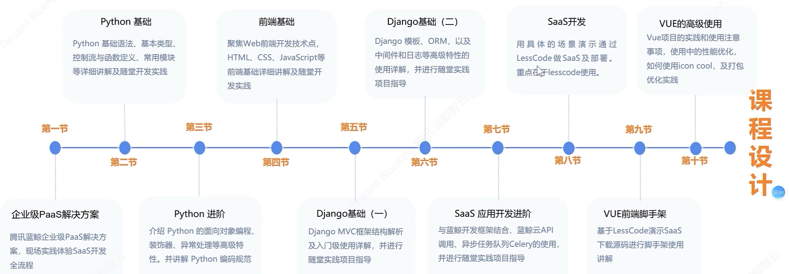

# 蓝鲸智云PaaS平台学习——第一课

腾讯游戏运营技术图谱

云数据平台有三层架构：IaaS、PaaS、SaaS

## 什么是PaaS

**PaaS(Platform as a Service)**，提供软件部署平台(runtime),抽象掉了硬件和操作系统细
节开发者只需要关注自己的业务逻辑，不需要关注底层。云计算时代相应的服务器平台或者开发环境作为服务进行提供就成为了PaaS。

## 课程大纲

